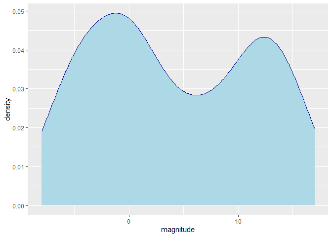
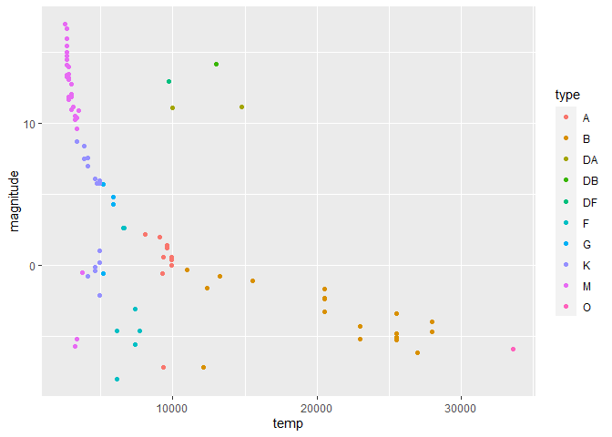

------------------------------------------------------------------------

title: “Data Analytics in R - Assignment 8” author: “Don Smith” output:
github_document

------------------------------------------------------------------------

### Question 1: Read in the stars dataset, which is included in base R. Include any packages you need to do your analysis.

``` r
library(tidyverse)
```

    ## ── Attaching packages ─────────────────────────────────────── tidyverse 1.3.2 ──
    ## ✔ ggplot2 3.4.0     ✔ purrr   1.0.1
    ## ✔ tibble  3.1.8     ✔ dplyr   1.1.0
    ## ✔ tidyr   1.3.0     ✔ stringr 1.5.0
    ## ✔ readr   2.1.3     ✔ forcats 1.0.0
    ## ── Conflicts ────────────────────────────────────────── tidyverse_conflicts() ──
    ## ✖ dplyr::filter() masks stats::filter()
    ## ✖ dplyr::lag()    masks stats::lag()

``` r
library(dslabs)
library(ggplot2)

data(stars)
```

### Question 2: Review the first 6 rows of the dataset.

``` r
head(stars)
```

    ##             star magnitude temp type
    ## 1            Sun       4.8 5840    G
    ## 2        SiriusA       1.4 9620    A
    ## 3        Canopus      -3.1 7400    F
    ## 4       Arcturus      -0.4 4590    K
    ## 5 AlphaCentauriA       4.3 5840    G
    ## 6           Vega       0.5 9900    A

### Question 3: What are the mean and standard deviation of the magnitude column?

``` r
mean(stars$magnitude)
```

    ## [1] 4.257292

``` r
sd(stars$magnitude)
```

    ## [1] 7.354308

### Question 4: Create a density plot using the magnitude column.

``` r
ggplot(stars, aes(x=magnitude)) + geom_density(color="darkblue", fill="lightblue")
```

<!-- -->

### Question 5: Plot the relationship between magnitude and tempurature.

``` r
stars %>%  ggplot(aes(temp, magnitude, color = type)) + geom_point()
```

<!-- -->

### Question 6: Plot the relationship between magnitude and tempurature, this time with y in the logarithmic scale.

``` r
stars %>%  ggplot(aes(temp, magnitude)) + geom_point() + scale_y_reverse() + scale_y_continuous(trans = "log10") + scale_x_reverse()
```

    ## Scale for y is already present.
    ## Adding another scale for y, which will replace the existing scale.

    ## Warning in self$trans$transform(x): NaNs produced

    ## Warning: Transformation introduced infinite values in continuous y-axis

    ## Warning: Removed 35 rows containing missing values (`geom_point()`).

<!-- -->

### Question 7: How many stars have a magnitude greater than 10 and temperature greater than 5000?

``` r
s1 <- stars %>% filter(magnitude >10 & temp >5000)
s1
```

    ##              star magnitude  temp type
    ## 1        *SiriusB      11.2 14800   DA
    ## 2       *ProcyonB      13.0  9700   DF
    ## 3 vanMaanen'sStar      14.2 13000   DB
    ## 4     *40EridaniB      11.1 10000   DA

``` r
count(s1)
```

    ##   n
    ## 1 4

### Question 8: How many stars have a stars with magnitude less than 0 and temperature less than 3500?

``` r
s2 <- stars %>% filter(magnitude < 0 & temp < 3500)
s2
```

    ##         star magnitude temp type
    ## 1 Betelgeuse      -5.7 3200    M
    ## 2    Antares      -5.2 3340    M

``` r
count(s2)
```

    ##   n
    ## 1 2
